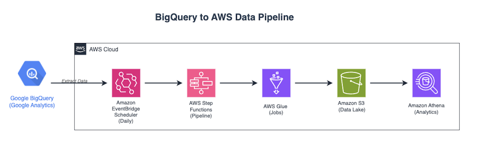

# BigQuery to AWS Glue Ingestion

This repository uses AWS CDK to deploy a robust, automated architecture that seamlessly extracts data from Google BigQuery and stores it in Amazon S3 for comprehensive analytical purposes. The solution utilizes AWS Glue Jobs for data extraction and transformation, with daily orchestration handled through AWS Step Functions and Amazon EventBridge scheduling.

Built for scalability and reliability, this serverless data pipeline eliminates manual intervention while ensuring your BigQuery data is consistently available in your AWS analytics ecosystem. Whether you're migrating analytics workloads, creating cross-platform data lakes, or building hybrid cloud analytics solutions, this architecture provides a production-ready foundation for your data ingestion needs.

[]

---

## Resources Deployed

This stack provisions and configures the following AWS resources:

1. **Amazon S3 Bucket**
   - Stores the Glue script and JDBC connector.
   - Serves as the destination for the data exported from BigQuery.

2. **AWS Glue**
   - ETL Script
      - A Python script uploaded to the S3 bucket.
      - Executes the data extraction from BigQuery and writes the results in Parquet format to S3.
   - Database and Table
      - A Glue Data Catalog database and table representing the target schema.
   - Connection (JDBC)
      - Connects Glue to BigQuery using the JDBC driver and the credentials stored in Secrets Manager.

3. **JDBC Connector**
   - A `.jar` file enabling JDBC connectivity between AWS Glue and Google BigQuery. * Note: * Please review versions and update if needed.

4. **VPC (Pre-existing)**
   - The Glue Job runs within an existing VPC for security and network access.

5. **AWS Secrets Manager**
   - Securely stores the GCP service account credentials (JSON format).

6. **AWS Step Function (EXPRESS Type)**
    - Orchestrates the Glue Job execution.

7. **Amazon EventBridge Rule**
    - Triggers the Step Function on a daily schedule (11:15 PM CST).

---

## What Does the ETL Script (`script.py`) Do?

This Python script performs the following steps:

1. Establishes a connection to Google BigQuery via JDBC and AWS Glue.
2. Executes a SQL query (customizable).
3. Converts the result into a DynamicFrame.
4. Writes the data to S3 in compressed **Parquet** format.
5. Updates the Glue Data Catalog with the new metadata.

---

## Prerequisites Before Deployment

Before deploying, you **must update the parameters** to match your environment:

---

## Deployment Steps

1. Ensure the AWS CLI and CDK are installed and configured.
2. Run the following commands:

```bash
npm install
```

```bash
cdk bootstrap
```

```bash
cdk deploy
```

---

> [!NOTE]
> The S3 bucket is created with `RemovalPolicy.DESTROY` for development purposes. Modify this if persistence is needed in production.
> The Secret created via `Secret.fromSecretNameV2` assumes the secret already has existing parameters configured. Ensure it is correctly configured before deployment.
> The EventBridge rule triggers the Step Function at **11:15 PM CST (05:15 AM UTC)**. You can change this in the CDK code.
> The architecture supports multi-source pipelines and is easily extensible with more Glue Jobs, multiple BQ tables, or other destinations.

---
